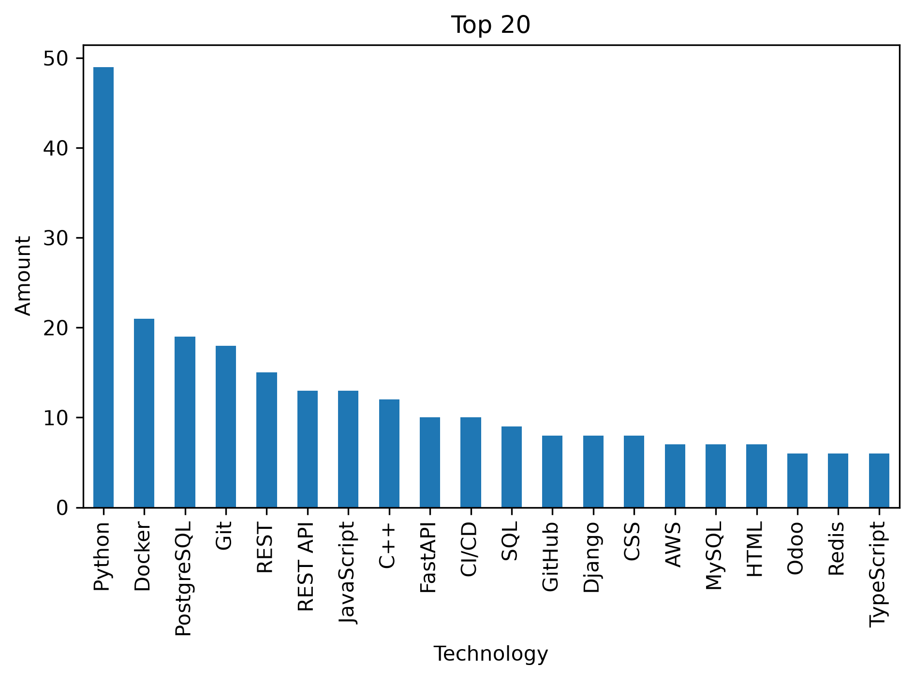

📊 Job Statistics Analyzer (Work.ua Scraper & Analyzer)
An asynchronous web scraper and automated analytics pipeline designed to extract job market data from Work.ua, process technology requirements, and generate high-resolution statistical visualizations.

⚠️ Important Notice: Anti-Bot & IP Protection
[!WARNING]
Intensive automated scraping on Work.ua frequently leads to temporary or permanent IP blocking due to advanced anti-bot security systems.

Best Practice: To ensure uninterrupted data collection, it is strongly recommended to use a VPN or route your requests through rotating proxy servers.

While the project implements polite delays (asyncio.sleep), proxies remain essential for scraping large-scale datasets.

🔍 Data Extraction (What We Scrape)
The asynchronous crawler navigates through search result pages and extracts key details for each vacancy:

💼 Job Title (title)

🏢 Company Name (company_name)

⏱️ Required Experience in years (experience)

🛠️ Skills & Technologies (skills) extracted from requirements (automatically filtered and cleaned to include standard ASCII technology names such as Python, Docker, SQL, Git, etc.)

📈 Visualizations & Analytics
Once the data is successfully scraped and saved to a CSV file, the analysis pipeline automatically takes over to:

Transform Data: Convert comma-separated text strings into structured numerical columns using One-Hot Encoding (0 and 1).

Aggregate Mentions: Calculate total occurrences for every technology across the entire dataset.

Rank & Plot: Filter the Top 15 Most Popular Technologies and generate a clean, readable Bar Chart.

Export: Save the chart as a high-resolution image (dpi=300) and display it instantly.

Sample Output Preview
🚀 Quick Start & Installation
1. Installation
Clone the repository and install all required dependencies:

Bash
pip install -r requirements.txt
2. Configuration
Open and configure your config.py file with your target search parameters (e.g., PYTHON_URL, BASE_URL, and browser headers).

3. Execution
Run the entire pipeline—from scraping raw data to generating and saving the analytics chart—using a single command:

Bash
python main.py